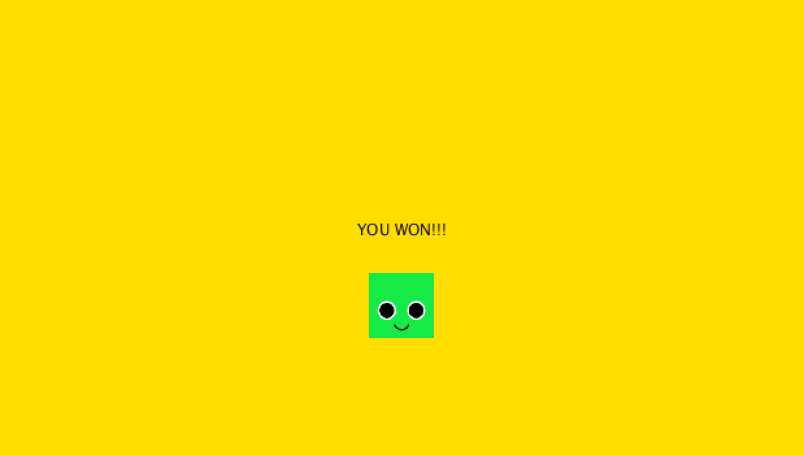

### Food Eater Game
For this project I decided to create a simple game where the player has to feed and clean a creature to grow it. The creature dies if it is underfed, overfed, or not cleaned. The player uses the UP button to feed the charachter and the DOWN button to wash it. 

### Challenges:
One challenge I faced while coding the project was trying to code the game in a dynamic manner where the game would adapt to any frame size given to it. The creatures features like legs would also adapt to the changing size of the character.

[Here is a video](https://www.youtube.com/watch?v=Ij3IZzFp4rI)

### Winning Screen:

