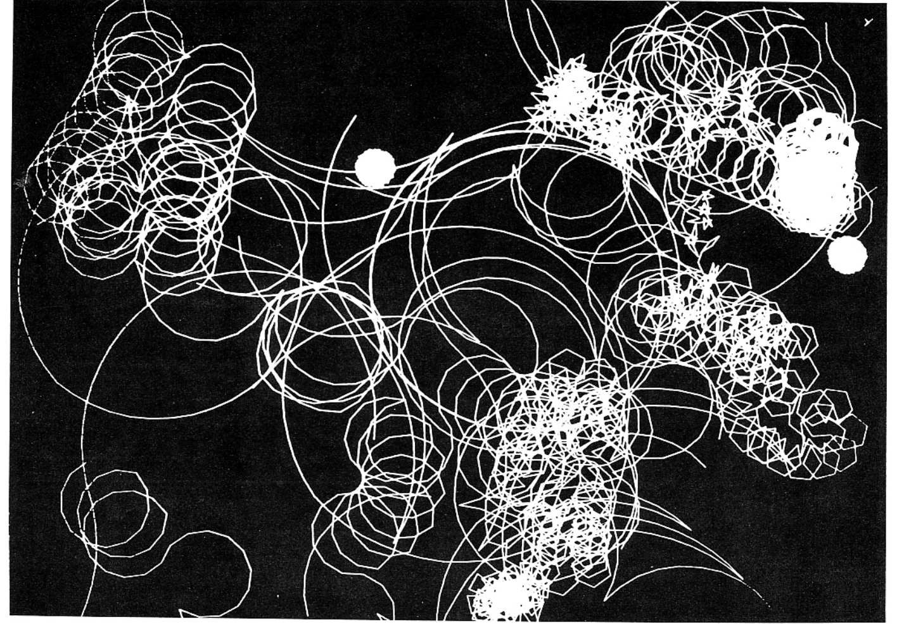
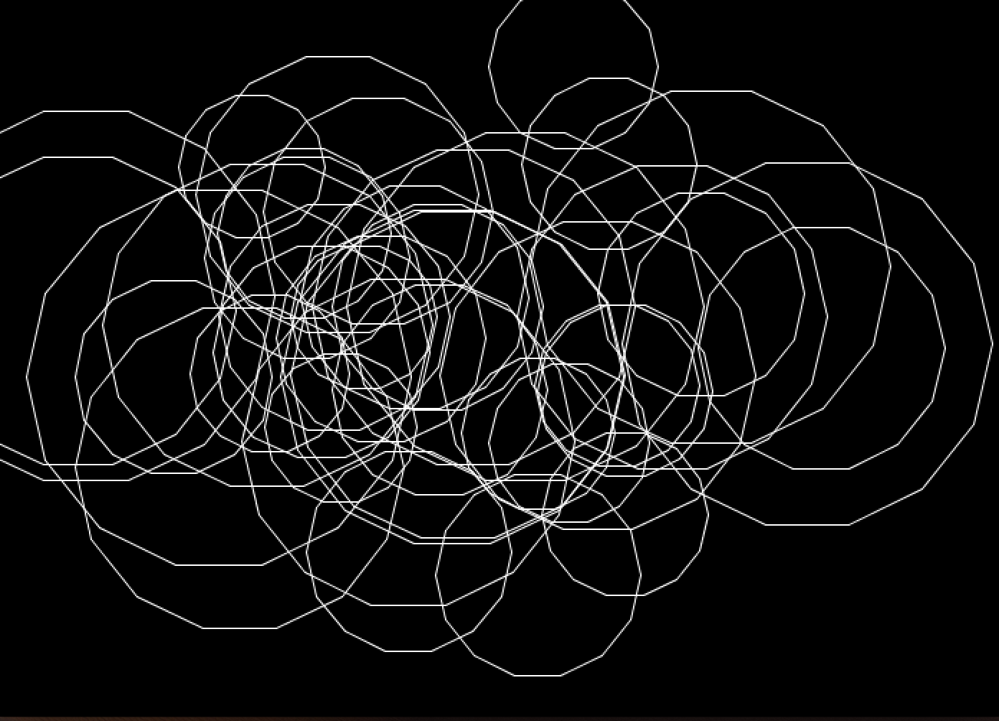
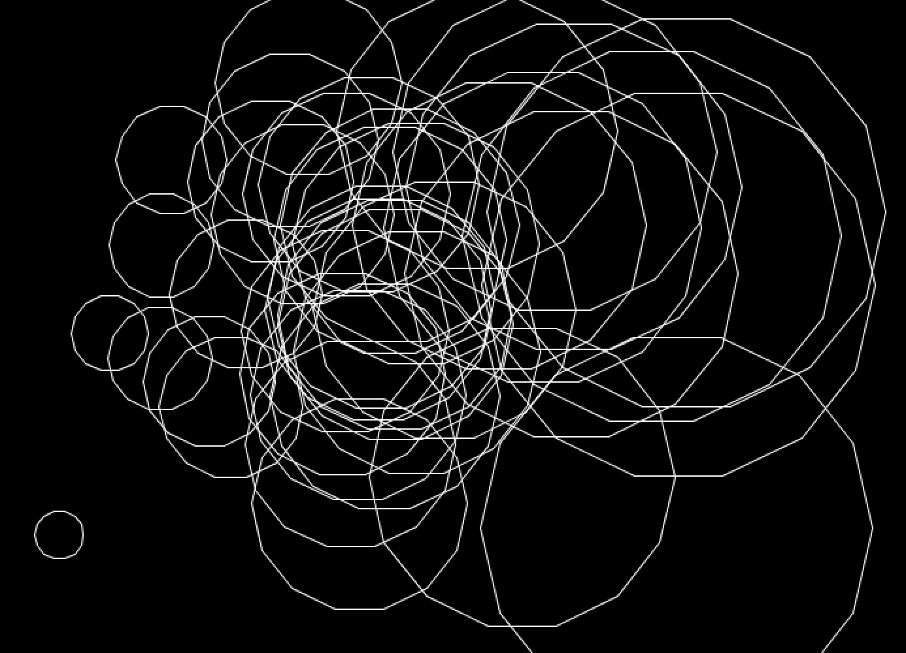
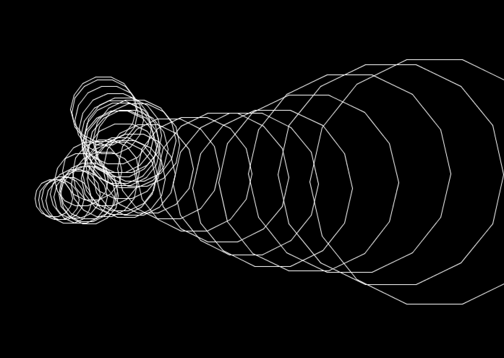
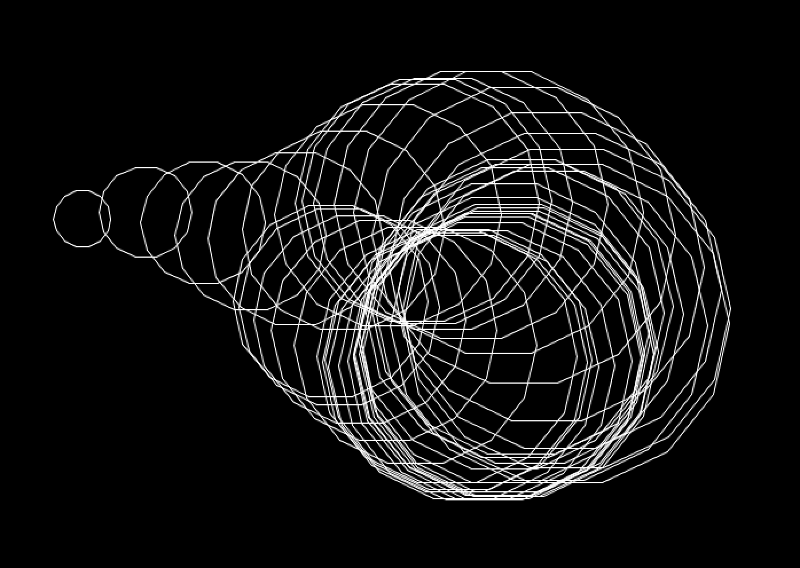

### Description:
I tried to recreate one of the computer arts I found in the pdfs recommended. My code generates different results everytime so i've included some of the results. 

### Images:
Original art:

Duplicated attempts:

Versions created by decreading the perlin noise values to 0.05 that I thought looked intresting:

### Complications:
In the original art some of the shapes are not closed or complete, but I was unable to create this effect because sometimes the side were drawn at an inverse angle and started going in the opposite direction. I eventually decided to leave this part out
