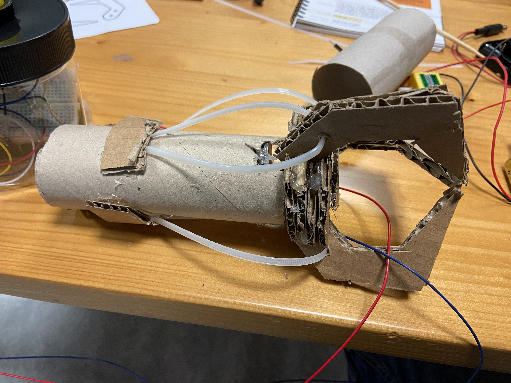
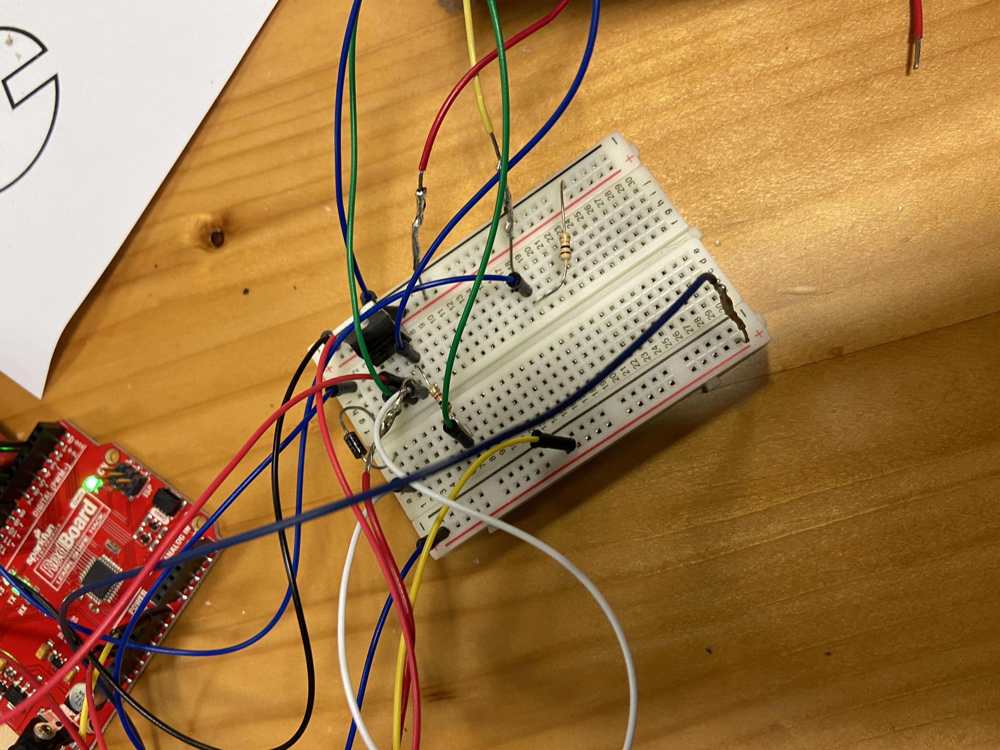
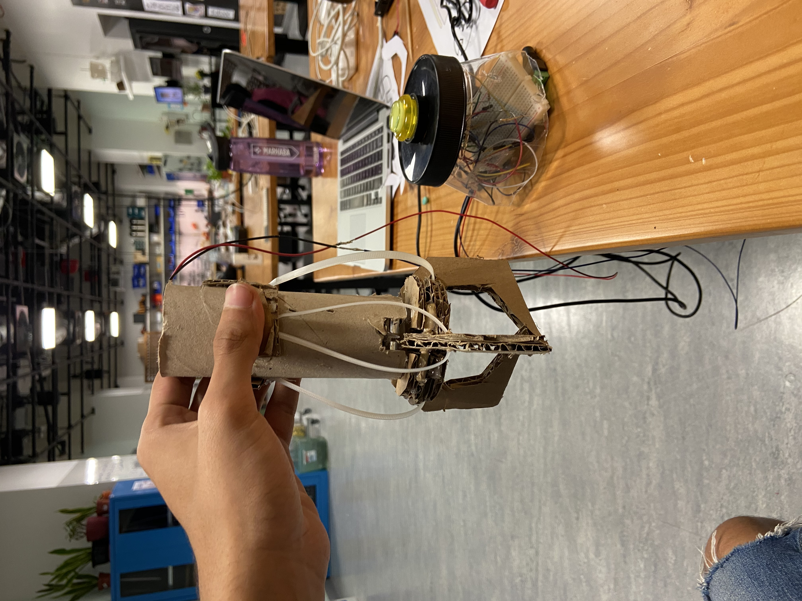
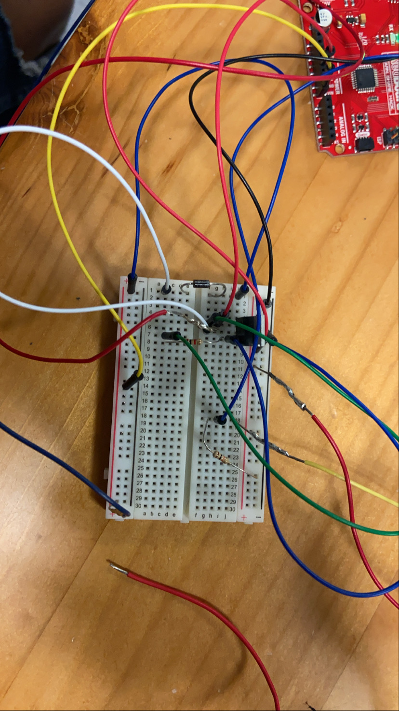

### Description:
For this project I tried to make my own version of an Arcade Claw. When desiging I had 2 different options for mechanism. The first option would use one or multiple servo motors, the servo motor(s) would be attached to each of the claws pincers. The mechanism was pull dependant, the pincer base is fixed while the wires connected to the pincers themselfs would be pulled to open the claw. The second option was push dependant, the pincers themselves would be fixed to the body with a more rigid connection than wires or strings, and the base would be the part that is pushed by a solenoid, this causes the claw to open. I went with the second option, using plastic zip ties to fix the pincers as they hold their form better. I traced all my pieces on cardboard, then cut them out. I attached all the cardboard peices with hot glue. I used short wooden sticks to hold the pincers to the base while also allowing them a free range of movement. A big challenge was figuirng out how to rest the solenoid on top of the base, as well as attaching a wooden stick to the end of the solenoid to be connected to the base and push it down. I first fixed the solenoid, using zip ties, to the inside of the tissue paper roll that I used for the body, but that way, the solenoid was not centered. So I attached the stick to the side of the plunger using a zip tie and hot glue. There were multipe problems with this method, when the solenoids plunger would spin arbitrarily the location of the stick connected to the base would change and no longer stay centered. The parts eventually fell apart because of constant movement breaking the hotglue apart and causing parts to slip out of the zip ties. I then decided to connect the stick directly under the plunger, as a part of it, that way spinning would not affect it. I also created a base out of sponge that fit perfectly in the tissue paper roll and that held the soleoid perfectly centered. Under the sponge base, there was a card board cutout with a hole in the middle only allowing the stick to pass through it and stay in place. This alternative method solved alot of problems. I then had a probelm with connecting the cuircuit. The 12V solenoid is able to take in an analog value and is precisely controllable, therefore has a very complicated method of connecting it. I struggled with that trying multiple connections until I was finally able to get it right. I first was using a 9 volt battery connected through a battery holder but then switched to a 12V power supply. I used an arcade button since i'm making an arcade claw. I wanted to add another part to my project, a servo motor that reels up a string / wire holding the claw and is controlled by two buttons. This would add the up down functionality of the arcade claw, but the servo motor was not able to handle the weight of the claw, as it was carrying a big 12V solenoid, also the connection between the reel and the motor was not strong enough. There might've been a work around this, either finding a stronger motor, using several motors, or using physics to think up of a more efficient way to usethe force of the motor to reel up the wire. I ended up desiging out this aspect of the claw as I was faced with a time constraint. [Here is a video](https://youtu.be/vIPvHhIUdww) of my functional project

### Schematic:

### Images:

