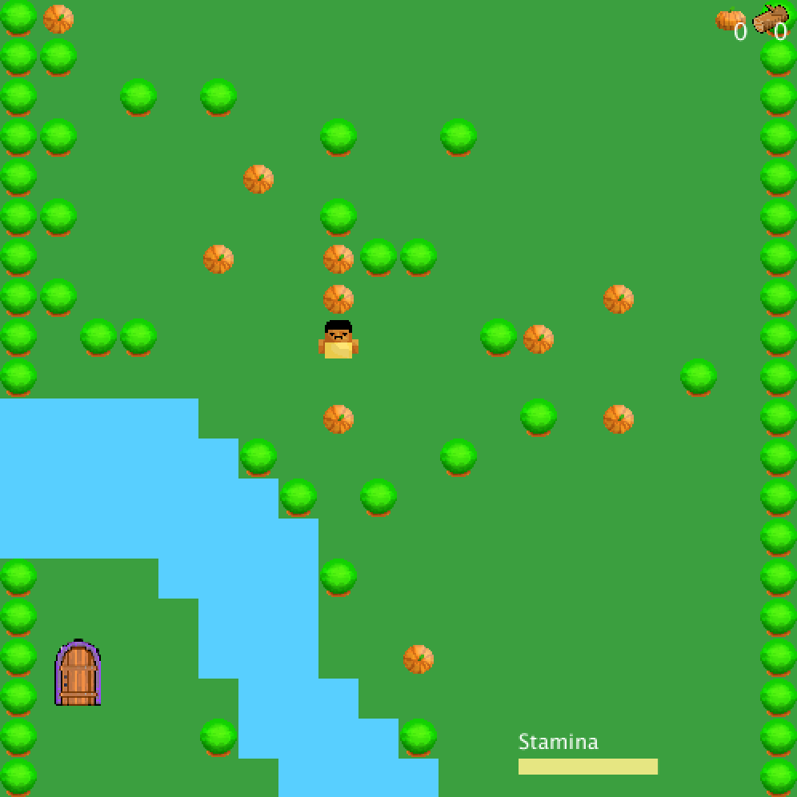

### Minecraft Inspired Survival Game
In this game the player needs to cross the river to get to the magical door. In order to cross the river the player must build a bridge across. Like in minecraft, the player needs to collect food and material to survive.
-The player uses arrows to move around
-SPACEBAR allows the player to break / utilise the object one square below him
-'e' is used to EAT collected food
-'c' is used to place down a wooden plank to create the bridge
-The player needs 2 tree logs to make one plank
-If the charachters stamina falls to zero the player dies

[Here is a video](https://www.youtube.com/watch?v=Ij3IZzFp4rI)

### Images:

### Challenges:
A challenge I faced was figuring out how to start the game and how to base it, especially with placing things at random locations and checking if certain objects were at certain locations. Eventually i thought about the 2d list idea that made palcing and checking for objects very easy.
